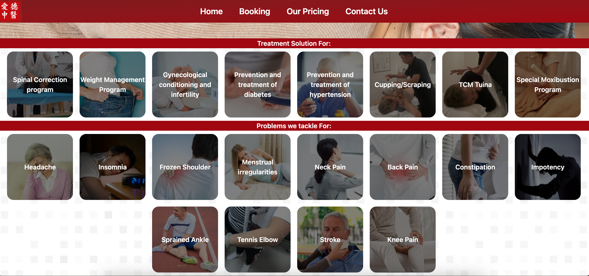
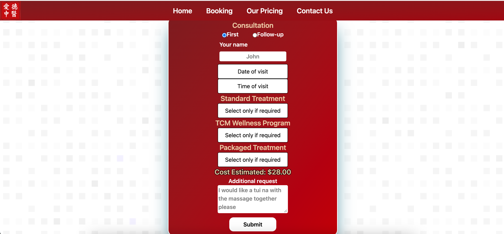
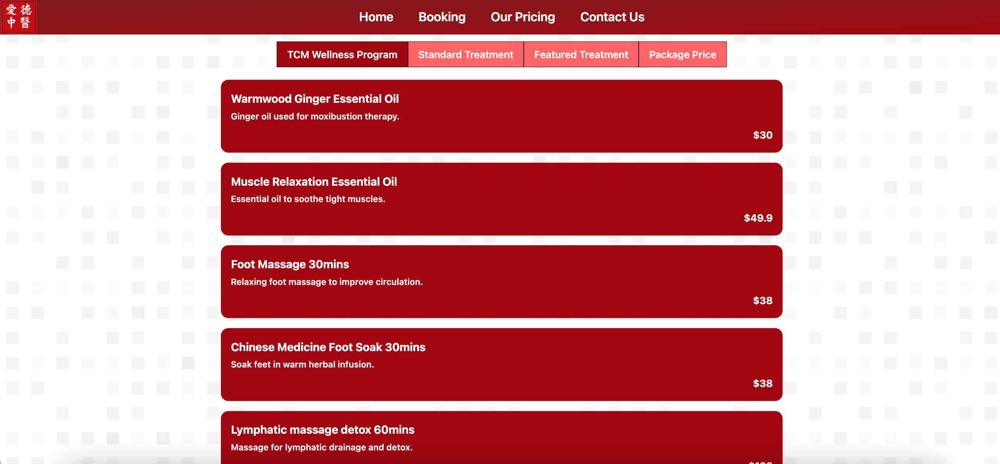
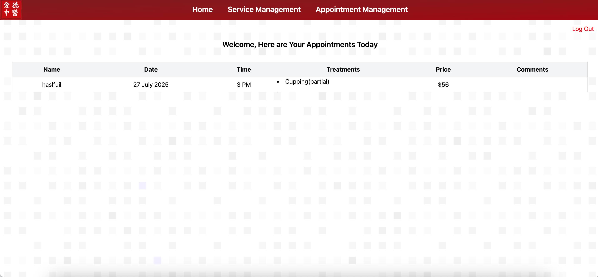
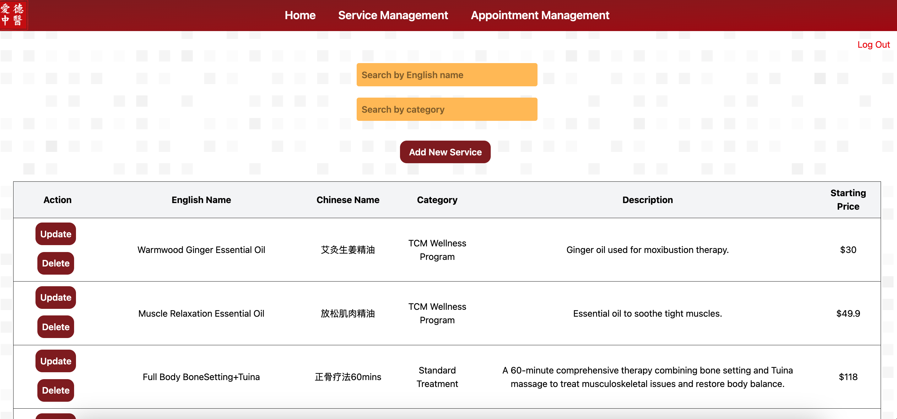
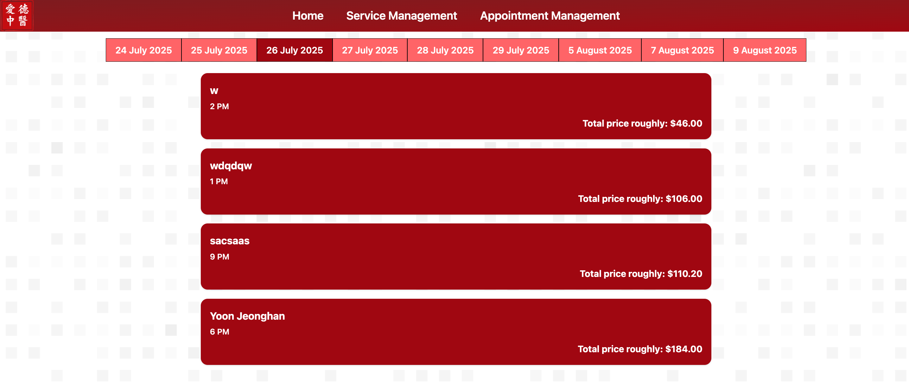

# Edward TCM

## Background 
Edward TCM is a newly opened TCM provider aiming to raise awareness and draw customers to their offerings. 

While their physical offerings such as location, interior and storefront marketing are appealing and well-executed, their online presence would benefit from improvements in their website/ online presence.

In addition to revamping the front end user interface, an admin portal is created to allow the client to be able to perform CRUD functionalities for their offerings directly to the backend database through an online interface.

## Screenshots

### Business Portal - Home Screen

### Business Portal - Appointments

### Business Portal - Prices

### Admin Portal - Dashboard

### Admin Portal - Service Management

### Admin Portal - Appointment Management

## Customer Flow 
- Homepage 
    - View Promotions and Product Offerings
    - CTA: Book Appointments

-   Booking
    - Customers input personal details as well as desired treatments, date and time into a form.
    - Form details gets populated in backend
    - Whatsapp link pops up with form-populated details, ready to be sent to the business.
    - Booking page redirects to a params link with specific appointment details.

- Charges 
    - Customers are able to click on treatment categories and treatments under the selected categories would render.

## Admin Flow 
- Login
    - Admins log in using a pre-created username and password.
    - Upon logging in, authentication is performed to ensure the username is valid and exists in a predetermined users table.
    -Upon successful authentication, a JWT token is generated and users are able to view the dashboard page.

- Dashboard
    - Admins are able to view their appointments for the day.
    - Admins are able to view menus for service management and appointment management.

- Service Management
    - Admins are able to perform CRUD functions to their service offerings, and these changes will be updated in the database and rendered on the front end in real time.
    - Admins are able to search for and fetch services via English name and Category on the same page.

- Appointment Management
    - Admins are able to perform CRUD functions to their appointments, and these changes will be updated in the database and rendered on the front end in real time. 
     - Admins are able to filter appointments by date.

    

## Technologies Used
- Mongo DB
- Vite
- Express
- Svelte
- Tailwind CSS
- Javascript CSS

## Links 🔗
- [Edward TCM Original Site](https://www.edwardtcm.com.sg/)
- [Front End Repository](https://github.com/Axercute/Project_3)
- [Project Trello Board](https://trello.com/b/8bSbzQ9N/my-trello-board)

## Acknowledgements
- @Axercute as a partner in the project and imparting knowledge on Svelte.

## Roadmap
- UI Improvements
- Adding a filter to table containing raw data fetched from backend, to prevent infinite scrolling.
- Translations to enable website to have a Chinese mode. 

